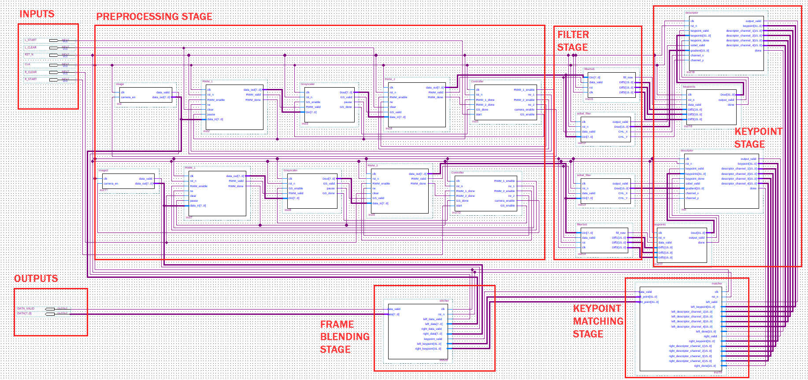

# ISP_MultiCam

参考文献：https://github.com/AugustinJose1221/FPGA-Build

https://zhuanlan.zhihu.com/p/75784915

总体设计

模块拆分

- [ ] Preprocessing stage
- [ ] Filter stage
- [ ] Keypoint stage
- [ ] Keypoint matching stage
- [ ] Frame blending stage

### Preprocessing stage
完成数据缓存，然后转成灰度图，再数据缓存

### Filter stage
包含一个5x5的滤波器和sobel filter，两个滤波器的用同一个输入源

算法说明
 

Scale Invariant Feature Transform (SIFT)

interest points detection stage

DoG
